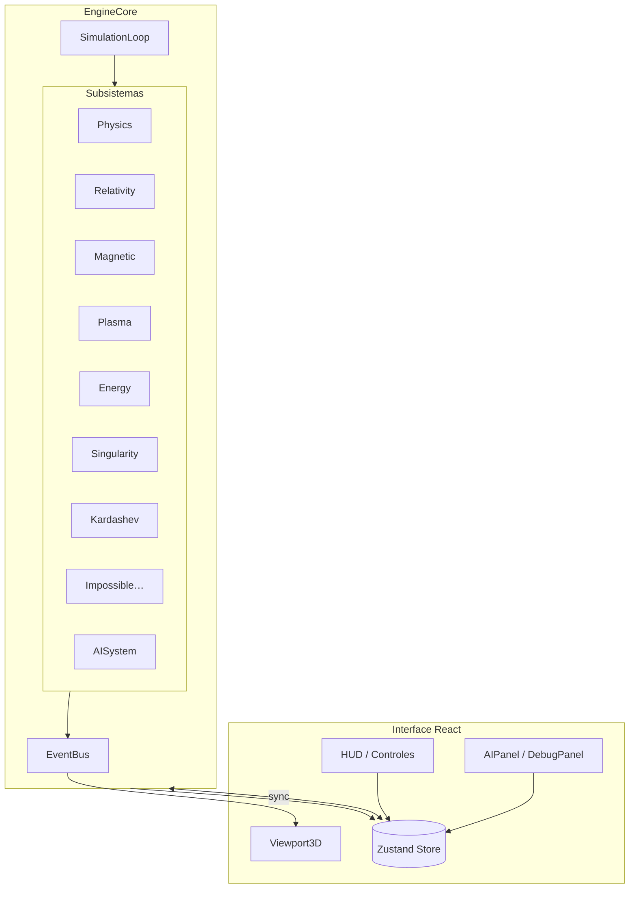

# Magnetic Ring Simulator

Simulador 3D interativo de um **reator de propulsão magnética toroidal** — laboratório visual de física especulativa, relatividade, plasma MHD, singularidades artificiais e sistemas de IA autônoma.

**Demo ao vivo:** [https://flxsistemas.com.br/reator/](https://flxsistemas.com.br/reator/)

---

## Visão geral

O **Magnetic Ring Simulator** combina um motor de simulação modular (fixed-step physics), renderização WebGL via **Three.js / React Three Fiber**, shaders GLSL customizados e camadas de inteligência artificial — incluindo um **cientista autônomo** com suporte a LLMs externas.

O projeto foi pensado como plataforma experimental: cada subsistema (plasma, relatividade, Kardashev, ruptura da realidade, hiperdimensão, energia impossível…) opera de forma independente, mas acoplada por um barramento de eventos e um loop de simulação central.

> **Aviso:** Este é um simulador **ficcional / educacional**. Os modelos físicos são aproximações visuais e heurísticas — não representam engenharia real de fusão ou propulsão.

---

## Funcionalidades

### Núcleo do reator
- Anel toroidal rotativo com controle de **RPM**, **campo magnético**, **plasma MHD** e **raio**
- Presets operacionais: Estável, Experimental, Crítico e Singularidade
- Núcleo energético, raios orbitais, singularidade artificial (horizonte de eventos, disco de acreção)
- Telemetria em tempo real: ω, velocidade tangencial, energia rotacional, fator de Lorentz, integridade estrutural

### Camadas 3D (15+ objetos toggleáveis)
| Grupo | Camadas |
|-------|---------|
| **Núcleo** | Anel, raios orbitais, núcleo energético, singularidade |
| **Campos** | Campo magnético, plasma, grade de dobra, bolha de desacoplamento |
| **Ambiente** | Tecido espaço-tempo, campo estelar, campo quântico, rasgos da realidade, névoa volumétrica, hiperdimensão |
| **Efeitos** | Onda de choque |

### Motores de simulação
| Motor | Descrição |
|-------|-----------|
| `PhysicsEngine` | Rotação, torque, stress estrutural |
| `RelativityEngine` | Fator de Lorentz, dilatação temporal, warp |
| `MagneticEngine` | Saturação e distorção espacial do campo B |
| `PlasmaEngine` | Confinamento MHD, turbulência, luminosidade |
| `EnergyEngine` | Temperatura, eficiência, sobrecarga |
| `StabilityEngine` | Risco operacional e modos críticos |
| `SingularityEngine` | Colapso gravitacional artificial |
| `KardashevEngine` | Escala de civilização e fluxo energético |
| `RealityRuptureEngine` | Instabilidade ontológica e rasgos causais |
| `ImpossiblePhysicsEngine` | Constantes variáveis (c, G, ℏ), dimensões extras |
| `HyperdimensionEngine` | Projeções 4D → 3D, tesseracts, eixo W |
| `DecouplingEngine` | Bolha de isolamento / inércia reduzida |
| `ImpossibleEnergyEngine` | Extração ZPE, matéria exótica, antimatéria |
| `AISystem` | Monitoramento, protocolos autônomos, sub-agentes |

### Inteligência artificial
- **IA de controle** — análise de ameaças, protocolos adaptativos, consciência simulada com temas visuais
- **IA Cientista autônoma** — ciclo hipótese → experimento → análise → relatório
- **Integração LLM** (opcional, via API key no navegador):
  - OpenAI (GPT-4o, GPT-4.1…)
  - Anthropic (Claude Sonnet 4.6, Opus 4.6, Haiku 4.5)
  - Google Gemini (2.5 Flash, API v1)
  - Mistral AI
  - Groq
- Exportação automática de relatórios em `.md` / `.txt`

### Renderização e performance
- Modos **Performance** e **Qualidade** (partículas, MSAA, bloom, DOF)
- Post-processing: bloom, aberração cromática, glitch, ruptura da realidade, distorção hiperdimensional
- Shaders GLSL modulares com sistema de `#include` (`buildShader.js`)
- Code-splitting: engine, viewport 3D, painéis de IA/debug carregados sob demanda

### Interface
- HUD lateral colapsável (Controles / Telemetria & IA)
- Painéis colapsáveis com estado persistido em `localStorage`
- Painel de debug com logs científicos e métricas do engine

---

## Stack tecnológica

| Camada | Tecnologia |
|--------|------------|
| UI | React 19, Zustand |
| 3D | Three.js, React Three Fiber, Drei |
| Pós-processamento | `@react-three/postprocessing`, postprocessing |
| Build | Vite 8 |
| Linguagem | JavaScript (ES modules) |
| Shaders | GLSL (importados como strings) |

---

## Arquitetura



**Fluxo de dados:** `useEngineBridge` conecta o Zustand store ao `EngineCore`. A cada tick físico, o engine emite eventos e sincroniza telemetria de volta para a UI. O `Viewport3D` consome o store e reage a eventos visuais (shockwave, glitch, ruptura…).

---

## Estrutura do projeto

```
magnetic-ring-simulator/
├── public/                 # Assets estáticos (.htaccess, favicon)
├── src/
│   ├── ai/                 # AISystem, cientista, LLM, sub-agentes
│   ├── components/         # HUD, Viewport3D, camadas 3D, painéis
│   ├── engine/             # Motores de simulação, ECS, presets
│   ├── hooks/              # Ponte engine ↔ React
│   ├── physics/            # Fórmulas físicas base
│   ├── postprocessing/     # Efeitos cinematográficos
│   ├── rendering/          # Presets performance/qualidade
│   ├── shaders/            # GLSL + catálogo por domínio
│   └── store/              # Zustand (simulatorStore)
├── deploy/reator/          # Build de produção (gerado)
├── vite.config.js
└── package.json
```

---

## Pré-requisitos

- **Node.js** 18+ (recomendado 20+)
- **npm** 9+

---

## Instalação

```bash
git clone https://github.com/SEU_USUARIO/magnetic-ring-simulator.git
cd magnetic-ring-simulator
npm install
```

---

## Desenvolvimento

```bash
npm run dev
```

Abre em [http://localhost:5173](http://localhost:5173).

### Scripts disponíveis

| Comando | Descrição |
|---------|-----------|
| `npm run dev` | Servidor de desenvolvimento Vite |
| `npm run build` | Build de produção → `deploy/reator/` |
| `npm run release` | Build + pasta `release/` (só estáticos, para Git/servidor) |
| `npm run preview` | Preview local do build |
| `npm run lint` | ESLint em todo o projeto |

---

### Publicar em subpasta (ex.: `/reator/`)

1. Execute `npm run release`.
2. Envie **todo** o conteúdo de **`release/`** para a pasta `/reator/` no servidor.
3. **Apague** arquivos antigos antes de substituir (hashes dos bundles mudam a cada build).
4. Confirme que `mod_rewrite` está ativo no Apache (`.htaccess` incluído).
5. No navegador: **Ctrl+F5** após o deploy.

---

## Configuração de LLM (opcional)

As chaves de API são armazenadas **apenas no `localStorage` do navegador** — nunca são enviadas ao repositório.

1. Abra o painel **Telemetria & IA** (barra direita).
2. Seção **IA Cientista** → configure provedor, modelo e API key.
3. Ative os toggles desejados (hipóteses, relatórios, análise).

Provedores suportados: OpenAI, Anthropic, Google Gemini, Mistral, Groq.

---

## Como usar

1. **Presets** — escolha um modo operacional no HUD (Estável é o default).
2. **Sliders** — ajuste RPM, campo magnético, plasma e raio do anel.
3. **Camadas 3D** — ligue/desligue objetos individuais da cena.
4. **Física impossível** — altere constantes fundamentais e dimensões.
5. **Hiperdimensão / Desacoplamento / Energia impossível** — subsistemas avançados nos painéis colapsáveis.
6. **Renderização** — alterne Performance ↔ Qualidade conforme seu hardware.
7. **IA** — ative monitoramento autônomo ou o cientista com LLM.

Use **Resetar Reator** para voltar ao preset Estável e limpar estados críticos.

---

## Eventos do engine (amostra)

O `EventBus` emite eventos como:

- `RPM_CRITICAL`, `OVERLOAD`, `ENERGY_RUPTURE`
- `SINGULARITY_MODE`, `GRAVITATIONAL_COLLAPSE`
- `REALITY_RUPTURE`, `IMPOSSIBLE_REGIME_CHANGE`
- `ZERO_POINT_SURGE`, `ANTIMATTER_BREACH`, `IMPOSSIBLE_ENERGY_COLLAPSE`
- `KARDASHEV_TYPE_CHANGE`, `HYPERDIMENSION_SHIFT`

Úteis para extensões, logging externo ou integração multiplayer futura.

---

## Contribuindo

Este README descreve o projeto de **desenvolvimento (privado)**.

O repositório **público** contém apenas o build em `release/` e não aceita PRs de código-fonte.  
Para contribuir com o engine ou shaders, entre em contato com [FLX Sistemas](https://flxsistemas.com.br).

## Roadmap (ideas)

- [ ] WebGPU renderer path
- [ ] Testes unitários para engines críticos
- [ ] Modo multiplayer / telemetria remota
- [ ] Presets exportáveis/importáveis (JSON)
- [ ] Documentação interativa das equações

---

## Licença

Este projeto está sob a licença **MIT**. Veja o arquivo [LICENSE](LICENSE) para detalhes.

---

## Autor

Desenvolvido por **[FLX Sistemas](https://flxsistemas.com.br)**

- Site: [https://flxsistemas.com.br](https://flxsistemas.com.br)
- Demo: [https://flxsistemas.com.br/reator/](https://flxsistemas.com.br/reator/)

---

## Agradecimentos

- [Three.js](https://threejs.org/) e ecossistema [React Three Fiber](https://docs.pmnd.rs/react-three-fiber)
- [postprocessing](https://github.com/pmndrs/postprocessing) por efeitos cinematográficos
- Comunidade open source de shaders e visualização científica
